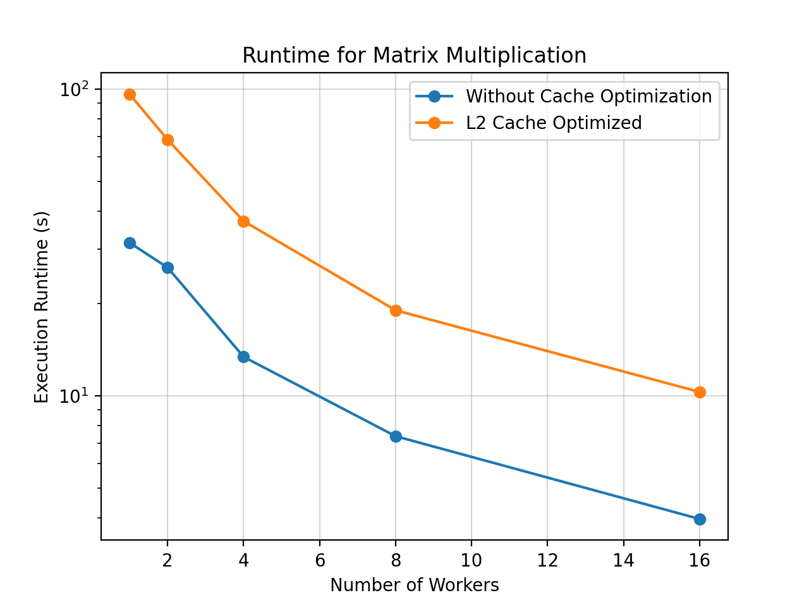

# Benchmarking Results

## Black Scholes

The following table shows the runtime for Black Scholes, averaged over 5 trials, using input data size of 1e9.

| Num Workers | Sequential | Parallelized Without Cache Optimization | Parallelized With Cache Optimization | Parallelized with L1 Cache Optimization |
| :---: | :---: | :---: | :---: | :---: |
| 1 | 232.878 | 237.947 | 103.517 | 93.652 |
| 2 | __ | 163.376 | 71.561 | 81.079 |
| 4 | __ | 85.370 | 36.956 | 40.485 |
| 8 | __ | 42.892 | 18.404 | 19.570 |
| 16 | __ | 22.544 | 9.756 | 10.368 |

<!-- The following table shows the slurm job id, for reference.

| Num Workers | Parallelized Without Cache Optimization | Parallelized With L1 Cache Optimization | Parallelized With L1 Cache Optimization |
| :---: | :---: | :---: | :---: |
| 1 | 6 | 630 | 640 |
| 2 | 6 | 629 | 639 |
| 4 | 6 | 628 | 638 |
| 8 | 6 | 627 | 637 |
| 16 | 6 | 626 | 636 | -->

630 - 0:67, 0:3765
640 - 0:67, 0:117648

629 - 0:34, 0:3658
639 - 0:34, 0:114286

<!-- | Num Workers | Sequential | Parallelized Without Cache Optimization | Parallelized With Cache Optimization |
| :---: | :---: | :---: | :---: |
| 1 | 232.878 | 237.947 | 103.526 |
| 2 | __ | 163.376 | 83.300 | 
| 4 | __ | 85.370 | 41.891 |
| 8 | __ | 42.892 | 21.776 |
| 16 | __ | 22.544 | 10.871 |

<!-- The following table shows the slurm job id, for reference.

| Num Workers | Parallelized Without Cache Optimization | Parallelized With Cache Optimization |
| :---: | :---: | :---: |
| 1 | 616 | 611 |
| 2 | 615 | 610 |
| 4 | 614 | 609 |
| 8 | 613 | 608 |
| 16 | 612 | 607 | --> -->

## Matrix Multiplication

The following table shows the runtime (s) for matrix multiplication A x B, averaged over 5 trials, where the dimensions of A and B are (1500, 10,000) and (10,000, 5000) respectively.

| Num Workers | Sequential | Parallelized Without Cache Optimization | Parallelized With L2 Cache Optimization |
| :---: | :---: | :---: | :---: |
| 1 | 40.920 | 31.543 | 96.275 |
| 2 | __ | 26.172 | 68.332 | 
| 4 | __ | 13.388 | 37.093 |
| 8 | __ | 7.380 | 18.993 |
| 16 | __ | 3.964 | 10.289 |

<!-- The following table shows the slurm job id, for reference.

| Num Workers | Parallelized Without Cache Optimization | Parallelized With Cache Optimization |
| :---: | :---: | :---: |
| 1 | 598 | 635 |
| 2 | 597 | 634 |
| 4 | 596 | 633 |
| 8 | 593 | 632 |
| 16 | 592 | 631 |

<!-- | Num Workers | Sequential | Parallelized Without Cache Optimization | Parallelized With Cache Optimization |
| :---: | :---: | :---: | :---: |
| 1 | 40.920 | 31.543 | 31.956 |
| 2 | __ | 26.172 | 28.699 | 
| 4 | __ | 13.388 | 14.735 |
| 8 | __ | 7.380 | 6.829 |
| 16 | __ | 3.964 | 3.951 |

<!-- The following table shows the slurm job id, for reference.

| Num Workers | Parallelized Without Cache Optimization | Parallelized With Cache Optimization |
| :---: | :---: | :---: |
| 1 | 598 | 603 |
| 2 | 597 | 602 |
| 4 | 596 | 601 |
| 8 | 593 | 600 |
| 16 | 592 | 599 | -->

597 - 1, 3, 1, 1  
602 - 1, 3, 8, 8  

jobs 619 (4), 620 (2), 621 (1) -->

